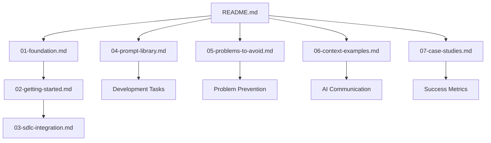

# Livefront AI Engineering Guide - Technical Documentation

## Overview

The Livefront AI Engineering Guide is a comprehensive resource for integrating AI tools into software development workflows while maintaining engineering standards and quality. Built from 6+ months of real team experience, this guide helps development teams adopt AI effectively without compromising code quality, security, or professional standards.

### What It Does

- **Provides structured learning paths** for AI tool adoption from individual developers to entire teams
- **Offers battle-tested prompts** for common development tasks (40+ tested prompts)
- **Documents anti-patterns** and common mistakes to avoid when using AI tools
- **Teaches context engineering** for more effective AI interactions  
- **Includes real case studies** with measurable metrics and outcomes
- **Maintains focus on professional standards** including security, accessibility, and code quality

### Key Benefits

- **70% time reduction** on routine development tasks while maintaining quality
- **Faster onboarding** for new AI tools with structured 4-week learning program
- **Risk mitigation** through documented security practices and anti-patterns
- **Team standardization** via shared prompt library and best practices
- **Measurable outcomes** with case studies showing real project metrics

## Architecture

### Repository Structure

The guide follows a modular, progressive learning architecture:

```text
livefront-ai-guidance/
├── README.md                    # Main entry point and navigation
├── 01-foundation.md            # Core concepts and mindset shift
├── 02-getting-started.md       # 4-week learning program
├── 03-sdlc-integration.md      # AI across development lifecycle
├── 04-prompt-library.md        # 40+ tested prompts by category
├── 05-problems-to-avoid.md     # Anti-patterns and solutions
├── 06-context-examples.md      # Good vs bad AI context patterns
├── 07-case-studies.md          # Real project examples with metrics
├── package.json                # Node.js tooling configuration
├── .github/workflows/          # CI/CD automation
├── .githooks/                  # Git pre-commit hooks
└── archive/                    # Historical and reference materials
```

### Content Architecture

#### Core Learning Path (Sequential)

1. **Foundation** → Establishes the "70% problem" and mindset shift
2. **Getting Started** → Hands-on 4-week adoption program  
3. **SDLC Integration** → AI throughout development lifecycle

#### Reference Materials (Random Access)

1. **Prompt Library** → Copy/paste solutions for common tasks
2. **Problems to Avoid** → Anti-patterns with solutions
3. **Context Examples** → Effective AI communication patterns
4. **Case Studies** → Real-world metrics and outcomes

### Information Flow



### Technology Stack

- **Documentation Format**: Markdown with strict linting
- **Tooling**: Node.JavaScript-based development environment
- **CI/CD**: GitHub Actions for automated quality checks
- **Quality Control**: Pre-commit hooks + CI pipeline
- **Version Control**: Git with structured branching

## API Reference

### Core Concepts

#### The 70% Problem

```markdown
**Definition**: AI consistently gets you 70% of the way to a solution quickly.
**Implication**: The remaining 30% requires human expertise and domain knowledge.
**Application**: Use AI for the routine work, apply human intelligence to the critical decisions.
```

#### Security-First Approach

```markdown
**Never Share**: API keys, customer data, client names, proprietary algorithms
**Always Sanitize**: Replace real data with placeholders before using AI
**Zero Compromise**: Security violations can destroy client trust instantly
```

#### Quality Gates

```markdown
**Test Coverage**: ≥80% on business logic
**Code Reviews**: 100% of code, including AI-generated
**Defect Rate**: <2% in production
**Accessibility**: WCAG 2.1 AA compliance
```

### Prompt Templates

#### Component Generation Template

```text
Create a [COMPONENT_TYPE] for [PLATFORM] with these requirements:

Technical Context:
- Tech Stack: [versions and libraries]
- Integration: [existing patterns to follow]
- Constraints: [performance, memory, etc.]

Functional Requirements:
- Purpose: [what it does]
- Props/Parameters: [with types]
- Behavior: [user interactions and logic]

Non-Functional Requirements:  
- Accessibility: [WCAG compliance level]
- Performance: [metrics and budgets]
- Security: [data handling requirements]

Output Format:
- [specific deliverables needed]
- [file structure and naming]
- [documentation requirements]

Context Examples:
[paste relevant existing code patterns]
```

#### Debugging Template

```text
Debug this issue: [brief description]

Error Details:
- Message: [exact error text]
- Stack Trace: [complete trace]
- Frequency: [how often it occurs]
- Context: [when it happens]

Environment:
- Platform: [OS, browser, device]
- Versions: [runtime, frameworks, libraries]  
- Configuration: [relevant settings]

Expected vs Actual:
- Expected: [what should happen]
- Actual: [what is happening]

Investigation Done:
- [steps already tried]
- [results of investigation]

Code Sample:
[minimal reproducible example]
```

### Context Engineering Patterns

#### The Perfect Context Formula

```text
[WHAT] I need to [specific task]
[WHERE] In our [technology stack/environment]  
[CURRENT STATE] We currently have [existing code/setup]
[REQUIREMENTS] It must [business/technical requirements]
[CONSTRAINTS] We cannot [limitations/restrictions]
[OUTPUT] Please provide [specific format/structure]
[FOCUS] Specifically focus on [main concerns]
```

## Configuration

### Development Environment Setup

#### Prerequisites

```bash
# Required
node -v  # v18.0.0 or higher
npm -v   # v9.0.0 or higher
git -v   # v2.30.0 or higher

# Optional but recommended
code -v  # VS Code for markdown editing
```

#### Installation

```bash
# Clone repository
git clone [repository-url] livefront-ai-guidance
cd livefront-ai-guidance

# Install dependencies
npm install

# Set up git hooks
npm run setup:hooks

# Verify setup
npm run lint:md
```

#### Available Scripts

```json
{
  "scripts": {
    "lint:md": "markdownlint-cli2 '**/*.md' '#node_modules' '#archive'",
    "setup:hooks": "git config core.hooksPath .githooks && chmod +x .githooks/pre-commit"
  }
}
```

### Markdown Linting Configuration

The repository uses `markdownlint-cli2` with standard rules to ensure:

- Consistent formatting across all documentation
- Proper heading hierarchy
- Valid link references
- Standardized code block formatting
- Accessible content structure

#### Lint Rules Applied

- **MD001**: Header levels increment by one
- **MD003**: Header style consistency
- **MD007**: Unordered list indentation  
- **MD009**: No trailing spaces
- **MD010**: No hard tabs
- **MD012**: No multiple consecutive blank lines
- **MD013**: Line length limits (relaxed for code blocks)
- **MD022-MD032**: Heading and list spacing consistency

### CI/CD Pipeline

#### Pre-commit Hook

```bash
#!/usr/bin/env bash
set -euo pipefail

# Lint only staged Markdown files
files=$(git diff --cached --name-only --diff-filter=ACM | grep -E '\.md$' || true)
if [ -z "$files" ]; then
  exit 0
fi

echo "Running markdownlint on staged Markdown files..."
./node_modules/.bin/markdownlint-cli2 $files
```

#### GitHub Actions Workflow

```yaml
name: Markdown Lint
on:
  pull_request:
    paths: ['**/*.md', 'package.json', 'package-lock.json']
  workflow_dispatch: {}

jobs:
  lint:
    runs-on: ubuntu-latest
    steps:
      - name: Checkout
        uses: actions/checkout@v4
      - name: Setup Node.js  
        uses: actions/setup-node@v4
        with:
          node-version: '20'
          cache: 'npm'
      - name: Install dependencies
        run: npm ci
      - name: Run markdownlint
        run: npm run lint:md
```

## Examples

### Individual Developer Onboarding

#### Week 1: Foundation Building

```markdown
Day 1: Setup and First Wins (2 hours)
- Install GitHub Copilot and Claude.ai
- Complete unit test generation exercise
- Build first component with AI assistance
- Document results and share with team

Day 2-3: Building Confidence  
- Use AI for 3 tasks daily (easy, curious, skeptical)
- Keep prompt journal for what works
- Focus on routine tasks first

Day 4-5: Expanding Toolkit
- Documentation generation with AI
- API client creation and testing
- Cross-platform development patterns
```

#### Success Metrics Tracking

```markdown
Individual Metrics (Track Weekly):
- Tasks attempted with AI: ___
- Success rate: ___%  
- Average time saved: ___ hours
- Quality issues introduced: ___
- Most useful discovery: ___________

Team Metrics (Track Monthly):
- Team velocity improvement: ___%
- Code review time reduction: ___%  
- Defect rate change: ___%
- Developer satisfaction: ___/10
```

### Team Implementation

#### Team Lead Checklist

```markdown
Phase 1: Foundation (Week 1-2)
□ Define team AI usage guidelines
□ Set up shared prompt repository
□ Establish quality gates for AI-generated code
□ Schedule weekly knowledge sharing sessions

Phase 2: Skill Building (Week 3-8)  
□ Pair programming with AI as "third developer"
□ Code review focus on AI-generated code
□ Build team-specific prompt library
□ Track velocity and quality metrics

Phase 3: Process Integration (Week 9-12)
□ Integrate AI into sprint planning
□ Establish AI-first task identification
□ Create escalation paths for AI limitations
□ Document team-specific patterns and anti-patterns
```

### Common Use Cases

#### 1. React Native Component Development

```text
Time Saved: 45 minutes → 5 minutes (89% reduction)
Quality Impact: Same or better (more consistent patterns)
Use Case: Form components, UI widgets, navigation screens

Prompt Pattern:
"Create a React Native [component] following our design system..."
+ Include existing component patterns
+ Specify TypeScript interfaces
+ Request accessibility compliance
+ Ask for comprehensive tests
```

#### 2. API Integration

```text  
Time Saved: 2 hours → 30 minutes (75% reduction)
Quality Impact: More comprehensive error handling
Use Case: REST clients, GraphQL queries, WebSocket connections

Prompt Pattern:
"Generate API client for [service] with these endpoints..."
+ Include authentication patterns
+ Specify error handling approach  
+ Request retry logic and timeouts
+ Ask for TypeScript definitions
```

#### 3. Test Generation

```text
Time Saved: 3 hours → 45 minutes (75% reduction)  
Quality Impact: Higher coverage, more edge cases
Use Case: Unit tests, integration tests, E2E scenarios

Prompt Pattern:
"Generate comprehensive tests for [code] covering..."
+ Include business rules to test
+ Specify test framework and patterns
+ Request edge case coverage
+ Ask for mock strategies
```

## Troubleshooting

### Common Problems and Solutions

#### Problem: Context Rot Spiral

**Symptoms**: AI becomes confused after 5-6 iterations, generates incorrect code
**Solution**: Reset context with complete specification

```markdown
When you feel the spiral starting:
1. Stop immediately  
2. Save any good code from conversation
3. Start fresh with complete requirements
4. Use the "one concern per conversation" rule
```

#### Problem: Over-Reliance on AI

**Symptoms**: Can't explain own code, anxiety without AI tools, quality degradation
**Solution**: Active engagement protocol

```markdown
Prevention tactics:
- Read every line before accepting
- Comment your understanding  
- Test manually with edge cases
- Time-box AI assistance (30 min solo first)
- Weekly skill maintenance routine
```

#### Problem: Quality Degradation

**Symptoms**: Inconsistent patterns, increased bugs, technical debt accumulation
**Solution**: Implement quality gates

```markdown
Before accepting AI code:
□ Matches our style guide
□ Follows project patterns  
□ Has appropriate error handling
□ Includes tests
□ Documentation complete
□ No TODO comments
□ Performance reviewed
□ Accessibility compliant
```

#### Problem: Security Leaks

**Symptoms**: Sensitive data in prompts, client information shared with AI
**Solution**: Sanitization protocol

```markdown
Before every prompt:
□ No actual email addresses
□ No actual names  
□ No API keys
□ No production URLs
□ No client company names
□ No production data values
□ No internal service names
```

### Emergency Procedures

#### When to Pull the Emergency Brake

```markdown
Immediate stop conditions:
- Security leak potential detected
- Quality metrics drop below standards
- Team member can't code without AI
- Client expresses concerns
- Production incidents increase

Emergency protocol:
1. Pause AI usage for affected developer/team
2. Review recent AI-assisted work  
3. Create remediation plan
4. Gradual reintroduction with controls
5. Conduct lessons learned session
```

### Getting Help

#### Internal Support Channels

- **Slack**: #dev-ai for team discussions
- **Code Reviews**: Extra scrutiny for AI-generated code
- **Pair Programming**: Senior + junior for AI learning
- **Weekly Stand-ups**: Share wins and challenges

#### External Resources

- **AI Tool Documentation**: Platform-specific best practices
- **Community Forums**: Stack Overflow, Reddit AI programming
- **Training Resources**: Official tutorials and courses
- **Security Guidelines**: OWASP, industry-specific compliance

## Performance Considerations

### Development Velocity Impact

#### Measured Improvements

```markdown
Common Task Time Reductions:
- Form component creation: 2 hours → 30 minutes (75%)
- Test coverage generation: 4 hours → 45 minutes (81%)  
- API documentation: 1 hour → 10 minutes (83%)
- Debugging investigation: 4 hours → 45 minutes (81%)
- Code refactoring: 3 hours → 1 hour (67%)
```

#### Velocity Metrics to Track

```markdown
Team-Level KPIs:
- Sprint velocity (story points per sprint)
- Lead time (ticket creation to deployment)
- Code review time (PR open to merge)
- Defect rate (bugs per release)
- Developer satisfaction scores

Individual KPIs:
- Time saved per week (hours)
- AI task success rate (%)
- Code quality metrics (coverage, complexity)
- Learning velocity (new skills per month)
```

### AI Tool Performance Optimization

#### Prompt Optimization Strategies

```markdown
For Faster Responses:
- Use specific, focused prompts vs. broad requests
- Include relevant context only (avoid information overload)
- Break complex tasks into smaller chunks
- Reuse successful prompt patterns

For Better Quality:
- Include existing code patterns as examples
- Specify constraints and requirements upfront
- Request specific output formats
- Ask for explanation of complex logic
```

#### Resource Management

```markdown
Managing AI Tool Usage:
- Set daily/weekly limits to prevent over-reliance
- Use local tools for sensitive code review
- Batch similar tasks for efficiency
- Cache successful prompts for reuse
- Monitor tool costs and usage patterns
```

### Code Quality Performance

#### Maintaining Standards with AI

```markdown
Quality Assurance Strategies:
- Extra code review time for AI-generated code
- Higher test coverage requirements (90%+ vs 80%)
- Automated linting and formatting enforcement
- Regular refactoring of AI-generated code
- Human verification of business logic
```

#### Technical Debt Management

```markdown
Preventing AI-Related Technical Debt:
- Regular refactoring sessions
- Pattern library maintenance  
- Code style consistency enforcement
- Documentation requirements for AI code
- Architecture review for AI suggestions
```

## Security Considerations

### Data Protection

#### Never Share with AI

```markdown
Prohibited Information:
- Production API keys or secrets (even "dead" ones)
- Actual customer data or PII
- Client company names or identifying information
- Production URLs or internal service names
- Proprietary algorithms or business logic
- Database schemas with real data
- Authentication tokens or credentials
```

#### Sanitization Protocol

```markdown
Before Every AI Interaction:
1. Replace real data with placeholders
   - emails: user@example.com  
   - names: John Doe, Jane Smith
   - companies: [CLIENT], [COMPANY]
   - URLs: https://example.com
   - IDs: user123, order456

2. Use synthetic data for examples
   - Generate fake but realistic test data
   - Create fictional scenarios that mirror real problems
   - Sanitize error messages and logs

3. Review prompts before sending
   - Double-check for sensitive information
   - Verify placeholder usage
   - Confirm context is properly anonymized
```

### Access Control and Auditing

#### Team Access Management

```markdown
AI Tool Access Controls:
- Use company-managed accounts where possible
- Implement approval process for new AI tools
- Regular access review and cleanup
- Monitor usage patterns and costs
- Document approved tools and use cases
```

#### Audit Trail Maintenance

```markdown
Documentation Requirements:
- Log significant AI-generated code in commit messages
- Track which AI tools were used for what features
- Maintain prompt library with version history
- Document security reviews of AI-generated code
- Record team training and guideline updates
```

### Compliance Considerations

#### Industry-Specific Requirements

```markdown
Healthcare (HIPAA):
- No PHI in AI prompts ever
- Extra verification for medical algorithms
- Audit trails for AI-assisted diagnostic tools
- Staff training on AI privacy requirements

Financial Services (SOX, PCI):
- No financial data in AI interactions
- Enhanced code review for payment processing
- Compliance validation for AI-generated audit controls
- Regular security assessments of AI tools

Government/Defense (FedRAMP, ITAR):
- Use only approved AI platforms
- Classification level restrictions
- Enhanced data sanitization requirements
- Regular security clearance reviews
```

#### Risk Assessment Framework

```markdown
Evaluate AI Usage Risk:
HIGH RISK: Customer data processing, authentication, payments
MEDIUM RISK: Business logic, integrations, internal tools  
LOW RISK: UI components, documentation, testing utilities

Risk Mitigation:
- Higher review requirements for high-risk code
- Mandatory pair programming for sensitive features
- Enhanced testing and validation protocols
- Regular security scanning and penetration testing
```

### Incident Response

#### Security Incident Protocol

```markdown
If Sensitive Data Exposed to AI:
1. Immediately stop using the affected AI tool
2. Document what information was shared
3. Notify security team and stakeholders
4. Review recent AI interactions for similar issues
5. Implement additional controls
6. Update team training and guidelines
7. Consider client notification if required
```

#### Prevention and Monitoring

```markdown
Ongoing Security Measures:
- Regular team security training
- Automated scanning for secrets in code
- Code review checklists including AI usage
- Incident response plan testing
- Vendor security assessment updates
- Tool usage monitoring and alerting
```

---

## Conclusion

The Livefront AI Engineering Guide provides a comprehensive framework for safely and effectively integrating AI tools into professional software development workflows. By following the structured approach, teams can achieve significant productivity gains while maintaining the quality standards and security practices that clients expect.

The guide emphasizes that AI is a powerful tool for accelerating routine development tasks, but human expertise remains essential for understanding business requirements, making architectural decisions, and ensuring the final 30% of quality that differentiates professional software development.

Regular updates to this documentation ensure it remains current with evolving AI capabilities and team experiences. For the latest information and to contribute improvements, see the main [README.md](README.md) file.

**Version**: 1.0 (September 2025)  
**Maintainer**: James Fishwick  
**Last Updated**: September 2025
